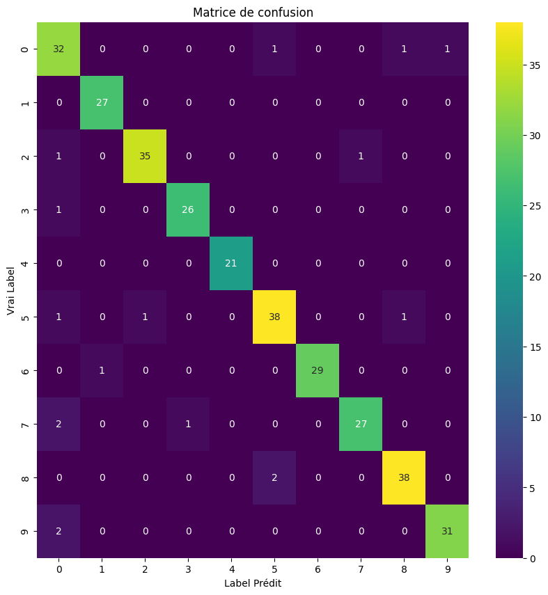
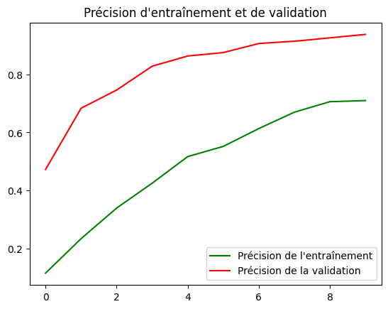
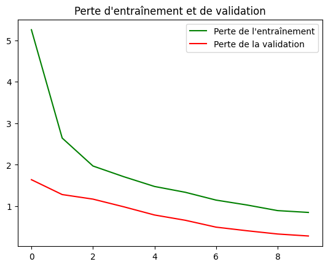

# BirdIdentifier 🐦

## Bonjour et bienvenue sur le dépôt du projet BirdIdentifier ! 👋

*******

Sommaire 
 1. [Accessibilité](#acces)
 2. [Présentation du projet](#presentation)
 3. [Notre jeu de données](#dataset)
 4. [Avancement](#avancement)
 5. [Visualisation](#visualisation)
 6. [Description des librairies](#libraries)
 7. [Auteurs](#auteurs)

*******

<div id='acces'/>   

## Accessibilité ↗️

> **Warning**: Le déploiement n'a pas encore été fait. 

Pour lancer la solution, il faut suivre les étapes suivantes : 
- Clôner le répertoire du projet : [Code#0](https://codefirst.iut.uca.fr/git/lou.broda/BirdIdentifier.git)  

```
git clone https://codefirst.iut.uca.fr/git/lou.broda/BirdIdentifier.git
```

- Changer la variable `DATABASE` avec le chemin de la base de données

```
# A CHANGER EN FONCTION DE VOTRE SYSTEME D'EXPLOITATION

# Linux/Macos 
DATABASE_PATH = "../database" <-- ICI
# Windows
# DATABASE_PATH = "..\\database"

print(f"{DATABASE_PATH}")
```

- Installer les librairies nécessaires [Librairies](#libraries)
```
pip install NOM_DE_LA_LIBRAIRIE
```

- Lancer le `notebook` du modèle nous intéressant

*******

<div id='dataset'/>  

## Notre jeu de données 📁

Notre jeu de données contient plus de **80000 images** de plus de **500 espèces d'oiseaux** différentes ! Parmi ces images, nous avons des images **d'entraînement**, de **test** et **d'imagination**. Il s'agit d'un jeu de données de très haute qualité, où chaque image ne contient qu'**un seul oiseau** occupant généralement **au moins 50 % des pixels** de l'image. En conséquence, même un modèle modérément complexe atteindra des précisions d'entraînement et de test dans la plage des **90 %**.  

Toutes les images sont au **format jpg** et ont une **taille de 224 x 224 x 3 pixels en couleur**. Le jeu de données inclut également un fichier **birds.csv**. Ce fichier CSV contient **5 colonnes** : 
- la colonne **filepaths** contient le chemin relatif du fichier image, 
- la colonne **labels** contient le nom de la classe d'espèce d'oiseau associée au fichier image, 
- la colonne **scientific label** contient le nom scientifique latin de l'image, 
- la colonne **data set** indique dans quel ensemble de données (entraînement, test ou validation) se trouve le chemin du fichier, 
- la colonne **class_id** contient la valeur d'index de classe associée à la classe du fichier image.  

*******

<div id='presentation'/>

## **Présentation** 🎉

BirdIdentifier : Votre identificateur d'oiseaux à partir d'une photo !  

*******

<div id='avancement'/>   

## Avancement

### Analyse du système :

Pour commencer, nous avons d'abord décidé d'analyser notre système et le jeu de données que nous avons choisi.      

Nous avons donc eu pour chaque donnée : un **X** (la photo de l'oiseau) et un **Y** (le nom de son espèce).  
Pour traiter ces derniers, nous avons pour la photo (X) : redimensionner celle-ci puis normaliser les pixels. Ensuite, pour le nom de l'espèce (Y), nous avons fait le choix de lui attribuer un entier.  
Un autre détail important et que nous avons placer ceux deux ensembles de valeurs dans des tableaux de tailles identiques avec les valeurs correspondantes à la même position.  

---

### Nos modèles :

A présent, nous avons dû passer au choix de notre modèle, ou plutôt de nos modèles dans notre cas. En effet, nous avons fait le choix de tester **2 modèles différents** :  
- Un **arbre de décision** avec deux espèces
- Un **réseau de neuronnes (CNN)** avec toutes les espèces 

Le premier modèle aura pour but de nous familiariser avec l'environnement de travail et les différentes librairies vu ci-dessus avec l'aide d'un cas simple.  
Le second sera une réelle implémentation du modèle en utilisant l'intégralité et l'ensemble des possibilités de notre jeu de données.  

---

### Premier modèle - Arbre de décision :

Nous avons donc débuté à l'aide d'un **cas binaire** et donc les deux espèces suivantes : *Masked Booby & Crested Coua*.

> *Processus d'entraînement du modèle :*  
>- Charger les données (photos des oiseaux)  
>- Placer les chemins des photos des oiseaux au sein d'un tableau
>- Récupérer les images de tests et les traiter :
>    - Redimensionnement
>    - Normalisation
>- Entraîner le modèle
>- Évaluer les performances sur l'ensemble de test

### Deuxième modèle - Réseau de neuronnes CNN :

Nous avons ensuite poursuivi en s'intéressant à l'ensemble des espèces proposées avec un modèle CNN.  

> *Processus d'entraînement du modèle :*  
>- **Préparation des données** : Les données ont été séparées en ensembles d'entraînement et de test. Les chemins des images ont été récupérés à partir d'un DataFrame.
>- **Data Augmentation** : Les images ont été soumises à des transformations aléatoires telles que le redimensionnement, le retournement horizontal, la rotation, le zoom et le contraste pour augmenter la variabilité des données.
>- **Construction du Modèle** : Un modèle de classification a été construit en utilisant EfficientNetB0 pré-entraîné comme base. Une couche de classification personnalisée a été ajoutée au modèle pour s'adapter à nos classes d'oiseaux.
>- **Compilation du Modèle** : Le modèle a été compilé avec l'optimiseur Adam et la fonction de perte de catégorisation croisée.
>- **Entraînement du Modèle** : Le modèle a été entraîné sur les données d'entraînement et évalué sur les données de validation. Des callbacks ont été utilisés pour surveiller et enregistrer le modèle pendant l'entraînement.
>- **Fin de l'entraînement** : Une fois l'entraînement terminé, l'historique de l'entraînement a été retourné, contenant les métriques de perte et de précision sur les ensembles d'entraînement et de validation à chaque époque.

---

### Traitement et Visualisation de l'image

L'une des techniques que nous avons découvert correspond à la visualisation d'image en utilisant des techniques d'analyse d'erreur.  

Cette partie vise à évaluer la qualité de compression JPEG des images, en utilisant des techniques d'analyse d'erreur de niveau (ELA) et de visualisation. 

> Une image **ELA** (Error Level Analysis) est une représentation visuelle qui met en évidence les différences de niveaux de compression dans une image JPEG. L'ELA est obtenue en soustrayant l'image d'origine de l'image compressée à un niveau de qualité spécifié, puis en ajustant la luminosité de cette différence pour la rendre plus perceptible.  

**Fonctionnalités principales :**

*Analyse d'Erreur de Niveau (ELA) :*  
    Les fonctions `compute_ela_cv` et `convert_to_ela_image` sont utilisées pour calculer l'image ELA à partir d'une image donnée.  
    L'ELA est obtenue en soustrayant l'image d'origine de l'image compressée à différents niveaux de qualité.  
    Les régions avec des niveaux d'erreur élevés indiquent des zones potentielles de manipulation ou de falsification dans l'image.

*Visualisation des Résultats :*  
    Le code fournit des scripts pour visualiser les résultats de l'analyse ELA pour une série d'images.  
    Les niveaux de qualité de compression JPEG sont ajustés progressivement pour chaque image afin d'évaluer l'impact sur l'ELA.

*Échantillonnage Aléatoire :*  
    La fonction `random_sample` est utilisée pour sélectionner aléatoirement un échantillon d'image à partir d'un répertoire spécifié.
    Cela permet de tester l'analyse ELA sur différentes images de manière aléatoire.

**Exemple d'utilisation :**  


---

### Pourquoi 2 modèles ?

Comme vous l'avez remarqué nous avons utilisé deux modèles différents (l'arbre de décision et le réseau de neuronnes).  

La première raison était que l'on souhaitait tester premièrement un modèle plus simple que l'on connaissait avec un nombre de classes limité (2). L'**arbre de décision** a donc fait totalement sens dans cette situation.  Ensuite, nous voulions un modèle plus actuel et complexe capable de gérer au mieux les centaines d'espèces disponibles dans notre base. Nous avons alors été attiré par **CNN** que nous avons sélectionné.  

Néanmoins, après avoir travaillé sur ceux-ci, nous tirons plusieurs avantages et inconvénients de chacun d'entre eux :  

**Arbre de décision** :  
- **Avantages** :  
    - Les arbres de décision sont simples à comprendre, interpréter et représenter même pour des non-experts.  
    - Les arbres de décision peuvent modéliser des relations non linéaires entre les caractéristiques et la variable cible.
    - Les arbres de décision ne nécessitent pas de normalisation des caractéristiques ou d'autres prétraitements complexes.

- **Inconvénients** :  
    -  Les arbres de décision sont sensibles aux variations dans les données d'entraînement, ce qui peut entraîner un surajustement si l'arbre n'est pas correctement régularisé.
    - Les arbres de décision ont tendance à créer des modèles trop complexes qui s'adaptent trop précisément aux données d'entraînement, ce qui peut entraîner une mauvaise généralisation sur de nouvelles données.
    - Les arbres de décision peuvent avoir du mal à capturer des relations complexes entre les caractéristiques et la variable cible, en particulier dans des ensembles de données de grande dimension.

**Réseau de neuronnes - CNN** :  
- **Avantages** :  
    - Les CNN peuvent apprendre des caractéristiques hiérarchiques à partir des données, ce qui leur permet de capturer des motifs complexes dans les images.
    - Les CNN sont très performants pour la vision par ordinateur, avec des performances souvent supérieures à celles des autres méthodes lorsqu'ils sont correctement entraînés.
    - Les CNN sont capables de s'adapter à une grande variété de données d'entrée, y compris des images de tailles différentes, et peuvent être utilisés pour un large éventail de tâches de classification et de détection d'objets.
    - Les CNN intègrent souvent des techniques de régularisation telles que le dropout et la normalisation par lots, ce qui réduit le risque de surajustement.

- **Inconvénients** :  
    - Les CNN nécessitent généralement de grandes quantités de données d'entraînement pour obtenir de bonnes performances, ce qui peut être un défi dans certains domaines.  
    - L'entraînement d'un CNN peut être intensif en termes de calcul et de temps, en particulier pour les architectures profondes et les ensembles de données volumineux.
    - Les modèles CNN sont souvent considérés comme des boîtes noires en raison de leur complexité, ce qui rend difficile l'interprétation de la manière dont les prédictions sont faites.    

---

*******

<div id='visualisation'/>

## **Visualisation des résultats** 

Afin d'évaluer et d'optimiser les modèles d'IA, deux éléments sont cruciaux : la **matrice de confusion** et la **courbe d'accuracy**. Nous avons pu mettre en place ces deux types de schéma pour nos deux types de modèle (Arbre de décision & Réseau de neurones).  

### Matrice de confusion

La **matrice de confusion** est un outil essentiel dans l'évaluation des performances d'un modèle d'apprentissage automatique. Elle permet de visualiser la performance d'un algorithme de classification en comparant les prédictions du modèle aux vraies valeurs cibles. La matrice de confusion présente les prédictions du modèle dans un tableau à deux dimensions où les lignes représentent les classes réelles et les colonnes représentent les classes prédites. Grâce à cette visualisation, on peut identifier les types d'erreurs que le modèle commet (comme les faux positifs et les faux négatifs) et ajuster le modèle en conséquence pour améliorer ses performances.




### Évaluation du Model

```
                            precision    recall  f1-score   support

       WHITE NECKED RAVEN       0.82      0.91      0.86        35
              APOSTLEBIRD       0.96      1.00      0.98        27
               ZEBRA DOVE       0.97      0.95      0.96        37
             GOLDEN EAGLE       0.96      0.96      0.96        27
            GAMBELS QUAIL       1.00      1.00      1.00        21
         D-ARNAUDS BARBET       0.93      0.93      0.93        41
           INDIAN BUSTARD       1.00      0.97      0.98        30
          SMITHS LONGSPUR       0.96      0.90      0.93        30
BLONDE CRESTED WOODPECKER       0.95      0.95      0.95        40
       GANG GANG COCKATOO       0.97      0.94      0.95        33

                 accuracy                           0.95       321
                macro avg       0.95      0.95      0.95       321
             weighted avg       0.95      0.95      0.95       321
```


Le modèle de classification des images d'oiseaux a montré une performance impressionnante avec une précision globale de 95%. Cela signifie que le modèle a correctement identifié la bonne espèce d'oiseau dans 95% des images de test.

En examinant les résultats pour chaque espèce d'oiseau, nous pouvons voir que le modèle a bien performé à travers toutes les classes. Par exemple, pour le "WHITE NECKED RAVEN", le modèle a une précision de 82% et un rappel de 91%. Cela signifie que lorsque le modèle prédit que une image est un "WHITE NECKED RAVEN", il est correct 82% du temps. De plus, il identifie correctement 91% des images réelles de "WHITE NECKED RAVEN".

Des performances similaires sont observées pour les autres espèces d'oiseaux. Par exemple, pour le "GAMBELS QUAIL", le modèle a atteint une précision et un rappel parfaits de 100%.

Ces résultats indiquent que le modèle est capable de distinguer efficacement entre différentes espèces d'oiseaux. Cependant, il est important de noter que la performance du modèle peut varier lorsqu'il est appliqué à de nouvelles images qui n'étaient pas dans l'ensemble de données de test.

### Courbe d'accuracy

Les **courbes d'accuracy** sont des graphiques qui montrent comment la performance d'un modèle varie en fonction d'un paramètre spécifique, souvent le seuil de décision dans le cas des modèles de classification.   
L'axe X des courbes représente le nombre d'époques. Chaque point sur l'axe X correspond à une époque d'entraînement. L'axe Y représente la précision (pour les courbes de précision) ou la perte (pour les courbes de perte). Pour les courbes de précision, une valeur plus élevée sur l'axe Y signifie que le modèle est plus précis. Pour les courbes de perte, une valeur plus faible sur l'axe Y signifie que le modèle a moins d'erreurs. 


Les courbes de précision d'entraînement et de validation augmentent toutes deux, ce qui indique que le modèle apprend et améliore ses performances à chaque époque. Le fait qu'elles augmentent à un rythme similaire est bon signe, cela suggère que le modèle généralise bien et ne mémorise pas simplement les données d'entraînement. La forme en "demi-arche" et le ralentissement de la croissance après la 8ème époque suggèrent que le modèle commence à converger, c'est-à-dire qu'il n'améliore pas autant avec chaque époque supplémentaire.


Les courbes de perte ressemblent aux courbes de précision mais inversées, cela signifie que la perte diminue à chaque époque, ce qui est une bonne chose. Une diminution de la perte signifie que le modèle fait moins d'erreurs sur les données d'entraînement et de validation. Si les courbes de perte d'entraînement et de validation diminuent à un rythme similaire, cela suggère que le modèle généralise bien. Si la courbe de perte de validation commence à augmenter alors que la courbe de perte d'entraînement continue de diminuer, cela pourrait indiquer un surapprentissage.
*******

<div id='libraries'/>   

## Librairies utilisées 📚  

### **cv2**    

> OpenCV (Open Source Computer Vision) est une bibliothèque open-source spécialisée dans le traitement d'images et la vision par ordinateur. En Python, la version la plus couramment utilisée de cette bibliothèque est appelée **cv2**.    

***Fonctionnalités*** :   

*Traitement d'Images* : OpenCV offre un ensemble complet de fonctionnalités pour lire, écrire, manipuler et traiter des images.

*Détection d'Objets* : La bibliothèque propose des outils puissants pour la détection d'objets, y compris la reconnaissance faciale, la détection de contours et la correspondance des formes.

*Transformation et Filtrage* : OpenCV permet la transformation d'images, la convolution, le filtrage et d'autres opérations permettant de modifier l'apparence des images.

*Vision par Ordinateur* : Idéale pour le développement de projets de vision par ordinateur, OpenCV fournit des algorithmes pour le suivi d'objets, la stéréovision, la calibration de caméra, etc.

[Documentation Officielle](https://opencv.org/)

### **os.path**   

> Le module **os.path** fait partie du module **os** en Python et offre des fonctionnalités spécifiques pour la manipulation des chemins de fichiers et des noms de fichiers.  

***Fonctionnalités*** :   

*Manipulation de Chemins* : Le module os.path fournit des méthodes pour manipuler des chemins de fichiers de manière portable entre les systèmes d'exploitation, en prenant en compte les différences dans les séparateurs de répertoire (/ ou \) et les conventions spécifiques à chaque plateforme.

*Validation de Chemins* : Vous pouvez utiliser les fonctions du module pour vérifier l'existence de fichiers ou de répertoires, tester si un chemin est absolu ou relatif, et obtenir des informations sur les fichiers comme la taille ou la date de modification.

*Construction de Chemins* : Facilite la création de chemins de fichiers en combinant des répertoires et des noms de fichiers de manière sûre et portable.

[Documentation Officielle](https://docs.python.org/3/library/os.path.html)  

### **matplotlib.pyplot**  

> **matplotlib.pyplot** est un module de la bibliothèque Matplotlib, largement utilisée pour la création de graphiques et de visualisations en Python. Ce module spécifique fournit une interface similaire à celle de MATLAB, facilitant la création de graphiques de manière interactive.  

***Fonctionnalités*** :   

*Création de Graphiques* : Matplotlib permet de créer une variété de graphiques, y compris des tracés de lignes, des histogrammes, des diagrammes à barres, des diagrammes en boîte, etc.

*Personnalisation* : Vous pouvez personnaliser chaque aspect du graphique, y compris les étiquettes d'axe, les titres, les couleurs, les styles de ligne, et plus encore.

*Visualisation en Temps Réel* : Idéal pour l'exploration de données, le module pyplot facilite la création de graphiques interactifs pour visualiser des données en temps réel.

[Documentation Officielle](https://matplotlib.org/3.5.3/api/_as_gen/matplotlib.pyplot.html)  

### **sklearn**  

> **scikit-learn**, également connu sous le nom de **sklearn**, est une bibliothèque open-source en Python dédiée à l'apprentissage automatique (machine learning). Elle offre des outils simples et efficaces pour la classification, la régression, le clustering, la réduction de dimensionnalité, et bien plus encore.

***Fonctionnalités*** :   

*Large Gamme d'Algorithmes* : scikit-learn propose une variété d'algorithmes d'apprentissage automatique, allant des méthodes classiques aux techniques avancées, couvrant la plupart des besoins en modélisation.

*Facilité d'Utilisation* : La bibliothèque est conçue pour être conviviale, avec une API cohérente et une documentation détaillée, facilitant la prise en main même pour les débutants.

*Traitement de Données* : sklearn fournit des outils pour la préparation et la transformation des données, y compris la normalisation, la standardisation, le traitement des valeurs manquantes, et plus encore.

*Évaluation des Modèles* : Des fonctions d'évaluation de modèles telles que la validation croisée, les courbes ROC, et les métriques de performance facilitent l'évaluation des performances des modèles.

[Documentation Officielle](https://scikit-learn.org/stable/)  

### **tensorflow**  

> **TensorFlow** est une bibliothèque open-source développée par Google, conçue pour effectuer des calculs numériques et des tâches d'apprentissage automatique (machine learning) à grande échelle. C'est l'une des bibliothèques les plus populaires pour la mise en œuvre de réseaux de neurones et d'autres modèles d'apprentissage profond.

***Fonctionnalités*** :   

*Construction de Graphiques de Calcul* : TensorFlow utilise un modèle de programmation basé sur des graphiques de calcul, où les opérations sont représentées sous forme de nœuds dans un graphe, permettant une exécution efficace sur diverses plateformes matérielles.  

*Apprentissage Profond* : La bibliothèque offre des outils complets pour la construction, l'entraînement et le déploiement de réseaux de neurones profonds (deep learning), y compris des couches pré-définies, des optimiseurs, des fonctions d'activation, etc.

*Traitement des Données* : TensorFlow propose des fonctionnalités pour le chargement, la préparation et le traitement des données, facilitant ainsi l'intégration des données dans le flux de travail de l'apprentissage automatique.

*Déploiement sur Différentes Plateformes* : La bibliothèque prend en charge le déploiement de modèles sur une variété de plateformes, notamment les ordinateurs de bureau, les serveurs, les appareils mobiles et même les périphériques IoT. 

[Documentation Officielle](https://www.tensorflow.org/learn?hl=fr)  

### **keras**  

> **Keras** est une bibliothèque open-source écrite en Python, conçue pour simplifier le développement et l'expérimentation de modèles d'apprentissage automatique (machine learning) et d'apprentissage profond (deep learning). Elle offre une interface simple et intuitive, tout en étant hautement personnalisable et extensible.

***Fonctionnalités*** :   

*Facilité d'Utilisation* : Keras propose une API conviviale, permettant aux utilisateurs de créer et de former des modèles d'apprentissage automatique avec un code clair et concis.

*Modularité* : La bibliothèque est basée sur un modèle de programmation modulaire, permettant de construire des architectures de réseaux de neurones en assemblant des couches (layers) de manière séquentielle ou fonctionnelle.

*Compatibilité Multi-plateformes* : Keras est compatible avec différentes bibliothèques de calcul numérique telles que TensorFlow, Theano et Microsoft Cognitive Toolkit (CNTK), offrant ainsi une portabilité des modèles sur diverses plateformes matérielles.

*Large Gamme de Couches* : Elle propose une large gamme de couches pré-définies pour la construction de réseaux de neurones, y compris des couches de convolution, des couches récurrentes, des couches d'activation, des couches de regroupement, etc.

[Documentation Officielle](https://keras.io/)  

### **numpy**  

> **NumPy** est une bibliothèque open-source en Python, spécialisée dans le calcul numérique et la manipulation de tableaux multidimensionnels. Elle fournit des fonctions puissantes pour effectuer des opérations mathématiques, statistiques et de manipulation de données, ce qui en fait un outil essentiel pour les scientifiques et les ingénieurs.

***Fonctionnalités*** :   

*Tableaux Numériques* : NumPy introduit un nouveau type de données appelé ndarray, qui est un tableau multidimensionnel homogène. Cela permet de stocker et de manipuler efficacement des données numériques en dimensions multiples.  

*Opérations Mathématiques* : La bibliothèque propose une large gamme d'opérations mathématiques, y compris les fonctions trigonométriques, les opérations d'algèbre linéaire, les fonctions de transformation de Fourier, etc.

*Manipulation de Données* : NumPy offre des outils puissants pour la manipulation de données, tels que le tri, l'indexation, le découpage, la concaténation et la répétition de tableaux, ainsi que des fonctions pour la manipulation des formes et des types de données.  

*Intégration avec d'Autres Bibliothèques* : NumPy est largement utilisé comme base pour de nombreuses autres bibliothèques Python, notamment Pandas, Matplotlib et SciPy, en raison de sa compatibilité et de sa performance.

[Documentation Officielle](https://numpy.org/)

### **pandas**  

> **Pandas** est une bibliothèque open-source en Python spécialisée dans l'analyse et la manipulation de données. Elle offre des structures de données puissantes et flexibles, ainsi que des outils pour effectuer des opérations de nettoyage, de transformation et d'analyse de données, ce qui en fait un outil indispensable pour les scientifiques des données et les analystes.

***Fonctionnalités*** :   

*Structures de Données* : Pandas introduit deux principales structures de données : les Series, qui sont des tableaux unidimensionnels étiquetés, et les DataFrame, qui sont des tableaux bidimensionnels étiquetés, permettant ainsi de stocker et de manipuler efficacement les données tabulaires.

*Manipulation de Données* : La bibliothèque offre une variété de fonctions pour la manipulation de données, y compris le filtrage, le tri, le regroupement, la fusion, la jointure, la pivotage, la transposition, et bien d'autres encore.

*Gestion des Données Manquantes* : Pandas propose des outils pour gérer les données manquantes, notamment en les identifiant, en les supprimant, en les remplaçant ou en les remplissant avec des valeurs appropriées.

*Analyse de Données* : Elle offre des fonctionnalités pour effectuer des opérations statistiques, telles que le calcul de la moyenne, de la médiane, de l'écart-type, de la corrélation, ainsi que des outils pour la visualisation des données.

[Documentation Officielle](https://pandas.pydata.org/)

*******

<div id='auteurs'/>

## **Auteurs** 👥

Étudiant 3ème Annnée - BUT Informatique - IUT Clermont Auvergne - 2023-2024   
`BRODA Lou` - `FRANCO Nicolas`
